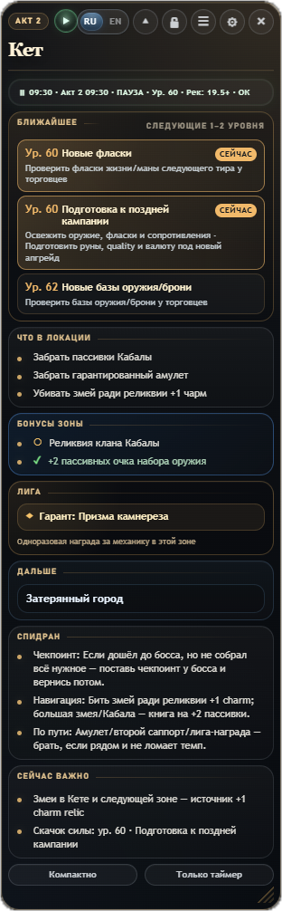
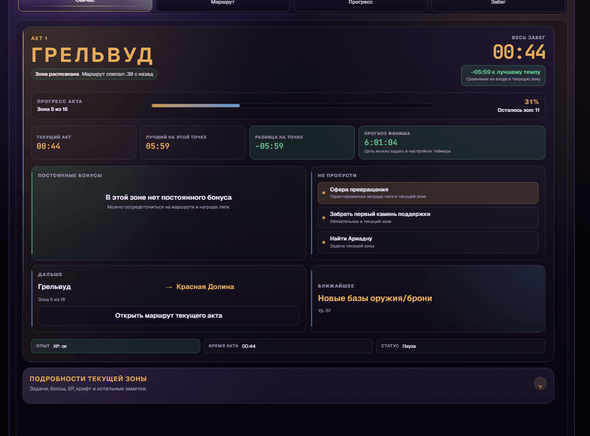

# POE2 Act Companion Overlay

Desktop-компаньон для прохождения кампании **Path of Exile 2**. Приложение читает локальный клиентский лог, распознаёт текущую зону и показывает маршрут, важные действия, постоянные бонусы, награды лиги и таймер забега поверх игры.





## Что умеет приложение

- распознаёт текущую зону по `Client.txt` или `LatestClient.txt`;
- показывает маршрут кампании и переход к следующей зоне;
- напоминает о постоянных бонусах, обязательных действиях и гарантированных наградах лиги;
- ведёт общий таймер, время актов, сплиты и историю забегов;
- сравнивает текущий темп с лучшим сопоставимым забегом;
- поддерживает полный, компактный и режим «Только таймер»;
- работает на русском и английском языках;
- содержит классическую тему и тему «Тёмное фэнтези»;
- сохраняет настройки, прогресс, размеры окон и историю забегов локально.

## Установка

Готовые Windows x64-сборки публикуются в разделе GitHub Releases:

https://github.com/UmbraMalik/poe2-act-companion-overlay/releases

После первого запуска мастер настройки предложит выбрать язык и тему, подключить лог-файл и проверить горячие клавиши.

## Запуск из исходников

Понадобятся Node.js и npm.

```powershell
npm ci
npm run dev
```

Основные проверки:

```powershell
npm test
npm run build:checked
npm run dist:checked
```

`npm run dist:checked` выполняет регрессионные проверки, production-сборку, bundle budget, сборку установщика и валидацию release-файлов.

## Структура проекта

- `src/main` — Electron main process, окна, IPC, чтение лога и хранение конфигурации;
- `src/renderer` — React-интерфейс оверлея, подробной панели и настроек;
- `src/shared` — общие типы, таймеры, маршруты и состояние приложения;
- `src/data` — гайды, постоянные бонусы и награды лиги;
- `tests` — unit, regression и static guard-тесты;
- `scripts` — проверки структуры, локализации, сборки и релизных артефактов.

## Перед релизом

Автоматическая проверка готовности документации и source-дерева:

```powershell
npm run check:release-readiness
```

Полный ручной smoke-чеклист находится в [`RELEASE_SMOKE.md`](RELEASE_SMOKE.md). История изменений — в [`CHANGELOG.md`](CHANGELOG.md).

## Обратная связь

- Telegram-канал: https://t.me/POE2ActCompanion
- Telegram-чат: https://t.me/POE2ActCompanionChat
- GitHub: https://github.com/UmbraMalik/poe2-act-companion-overlay

Проект не связан с Grinding Gear Games.
